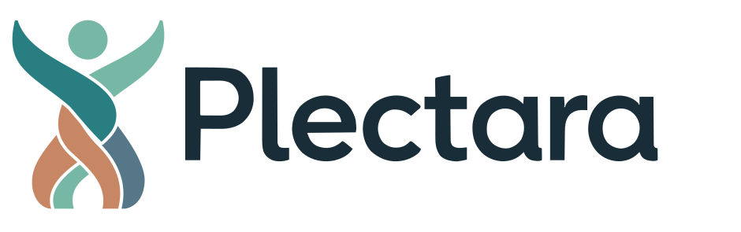
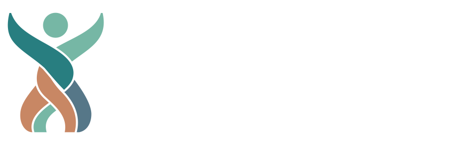
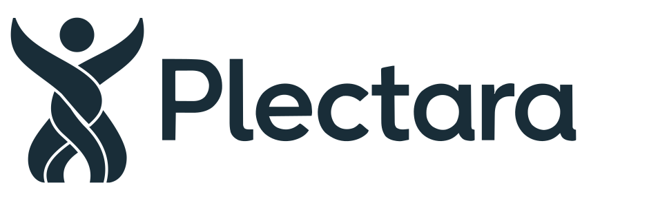
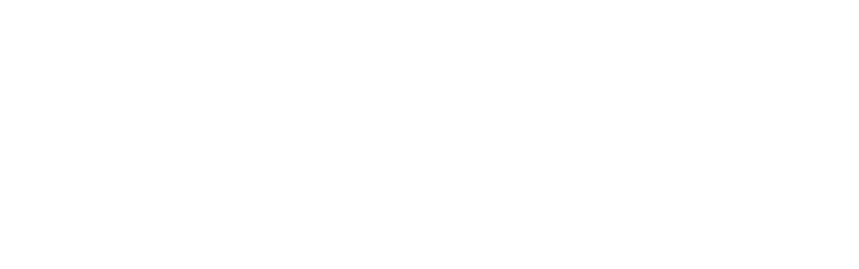
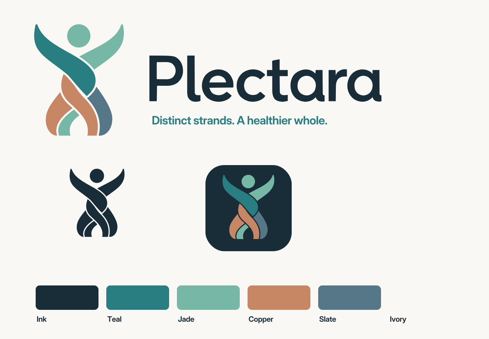

# Plectara brand kit

Status: Owner-approved color standard (2026-09-07)
Version: 2.1.0

**Every full-color Plectara logo has a jade head (`#76B7A5`).** The woven figure keeps the same colors on light and dark backgrounds. Only the lettering changes: ink on light backgrounds, white on dark backgrounds. In a monochrome logo, the entire figure and lettering use one color.

[Download the complete brand kit](../../assets/brand/plectara-brand-kit.zip){ .md-button .md-button--primary download="plectara-brand-kit-v2.1.0.zip" }

Choose an example below and download its SVG or PNG. SVGs scale without losing sharpness; PNGs are ready for documents, presentations, and other tools that accept images. The logo samples have transparent backgrounds. The ivory and ink panels show how to place them; those panels are not part of the downloaded artwork.

## Logos with lettering

Use these horizontal logos for website headers, documents, presentations, and marketing. Each PNG is 940 × 295 px. Keep the original proportions and spacing when resizing.

### Full color · light background

Jade head and four colored strands, with ink (`#192D38`) lettering. Use on white or ivory.

[Download SVG](../../assets/brand/plectara-horizontal.svg){ download="plectara-horizontal.svg" } · [Download PNG](../../assets/brand/plectara-horizontal.png){ download="plectara-horizontal.png" }

### Full color · dark background

The same jade head and colored strands, with white (`#FFFFFF`) lettering. Use on ink or a clear, approved dark background.

[Download SVG](../../assets/brand/plectara-horizontal-reversed.svg){ download="plectara-horizontal-reversed.svg" } · [Download PNG](../../assets/brand/plectara-horizontal-reversed.png){ download="plectara-horizontal-reversed.png" }

### Monochrome · ink

The head, every strand, and the lettering are ink (`#192D38`). Use for one-color reproduction on light backgrounds.

[Download SVG](../../assets/brand/plectara-horizontal-ink.svg){ download="plectara-horizontal-ink.svg" } · [Download PNG](../../assets/brand/plectara-horizontal-ink.png){ download="plectara-horizontal-ink.png" }

### Monochrome · white

The head, every strand, and the lettering are white (`#FFFFFF`). Use for one-color reproduction on dark backgrounds. The gaps remain transparent.

[Download SVG](../../assets/brand/plectara-horizontal-white.svg){ download="plectara-horizontal-white.svg" } · [Download PNG](../../assets/brand/plectara-horizontal-white.png){ download="plectara-horizontal-white.png" }

## Standalone symbols

Use the figure by itself when the Plectara identity is already clear. Full color always keeps its jade head; monochrome changes the entire figure to ink or white. Each PNG is 340 × 410 px.

### Full color

[Download SVG](../../assets/brand/plectara-symbol.svg){ download="plectara-symbol.svg" } · [Download PNG](../../assets/brand/plectara-symbol.png){ download="plectara-symbol.png" }

### Ink

[Download SVG](../../assets/brand/plectara-symbol-ink.svg){ download="plectara-symbol-ink.svg" } · [Download PNG](../../assets/brand/plectara-symbol-ink.png){ download="plectara-symbol-ink.png" }

### White

[Download SVG](../../assets/brand/plectara-symbol-white.svg){ download="plectara-symbol-white.svg" } · [Download PNG](../../assets/brand/plectara-symbol-white.png){ download="plectara-symbol-white.png" }

## Lettering standards

The Plectara wordmark is custom outlined artwork. Use the supplied files, including when the lettering appears without the figure. Preserve the original letter shapes, capitalization, spacing, proportions, and alignment. Do not type “Plectara” in Inter or another font to recreate the logo, adjust individual letters, or recolor the lettering jade.

| Placement | Lettering | Figure |
| --- | --- | --- |
| White or ivory background | Ink `#192D38` | Jade head; original strand colors |
| Ink or another approved dark background | White `#FFFFFF` | Jade head; original strand colors |
| One-color use on a light background | Ink `#192D38` | Entire figure ink |
| One-color use on a dark background | White `#FFFFFF` | Entire figure white |

### Ink lettering

[Download SVG](../../assets/brand/plectara-wordmark.svg){ download="plectara-wordmark.svg" } · [Download PNG](../../assets/brand/plectara-wordmark.png){ download="plectara-wordmark.png" }

### White lettering

[Download SVG](../../assets/brand/plectara-wordmark-white.svg){ download="plectara-wordmark-white.svg" } · [Download PNG](../../assets/brand/plectara-wordmark-white.png){ download="plectara-wordmark-white.png" }

Inter is the separate UI and supporting-copy typeface. The optional campaign line “A healthier whole” uses supporting typography and is not part of the logo. PL-OS uses the Plectara identity; do not replace the logo lettering with “PL-OS.” See [Typography](typography.md) for the UI type standards.

## Other ready-to-use assets

| Asset | Use | Downloads |
| --- | --- | --- |
| Stacked color logo | Portrait layouts on light backgrounds; jade head and ink lettering | [SVG](../../assets/brand/plectara-stacked.svg){ download="plectara-stacked.svg" } · [PNG](../../assets/brand/plectara-stacked.png){ download="plectara-stacked.png" } |
| Square app icon | Opaque 1024 × 1024 source for platform masking | [SVG](../../assets/brand/plectara-app-icon.svg){ download="plectara-app-icon.svg" } · [PNG](../../assets/brand/plectara-app-icon.png){ download="plectara-app-icon.png" } |
| Rounded avatar | Social profiles; jade head on ink | [SVG](../../assets/brand/plectara-avatar.svg){ download="plectara-avatar.svg" } · [PNG](../../assets/brand/plectara-avatar.png){ download="plectara-avatar.png" } |

The complete ZIP also includes platform icon sizes, a favicon, web manifest, iOS asset catalog, Android resources, social graphics, Inter and its license, design tokens, and an asset inventory.

## Placement and clear space

Allow one head diameter of clear space around the standalone symbol and half a head diameter around a logo with lettering. Prefer 32 px or larger for the full woven symbol and at least 140 px wide for the horizontal logo. At 16 px, the favicon communicates silhouette only.

Use a clear background and check the logo at its intended display size. If the full-color figure loses definition, increase its size, choose a clearer background, or use the complete monochrome version. Keep the full-color head jade in every case. Do not add outlines, shadows, gradients, or other effects.

## Source artwork and regeneration

Editable SVG masters live in `assets/brand/plectara/source/`, with generated PNGs in `assets/brand/plectara/png/`. The original reference PNG is retained for provenance only; it predates the jade-head standard and is not a current production asset. The owner-approved geometry, six-unit strand clearances, and outlined lettering from 2026-09-04 remain the construction baseline. The 2026-09-07 color standard supersedes the ink-headed full-color variant.

Install `tooling/requirements-brand.txt`, then run `python tooling/build-plectara-tokens.py`, `python tooling/build-plectara-brand.py`, and `python tooling/validate-brand.py`. The build regenerates the site downloads, brand board, inventory, and ZIP. CairoSVG also requires a system Cairo library.

Normal builds reuse `source/plectara-wordmark.svg`. Do not retrace or substitute the lettering during ordinary exports. Explicit wordmark recovery uses `--retrace-wordmark` under Python 3.12; the installed VTracer build crashes under Python 3.14.

See [Logo System](logo-system.md), [Logo Usage](logo-usage.md), and the [v2.1.0 migration notes](../../releases/v2.1.0/README.md).
