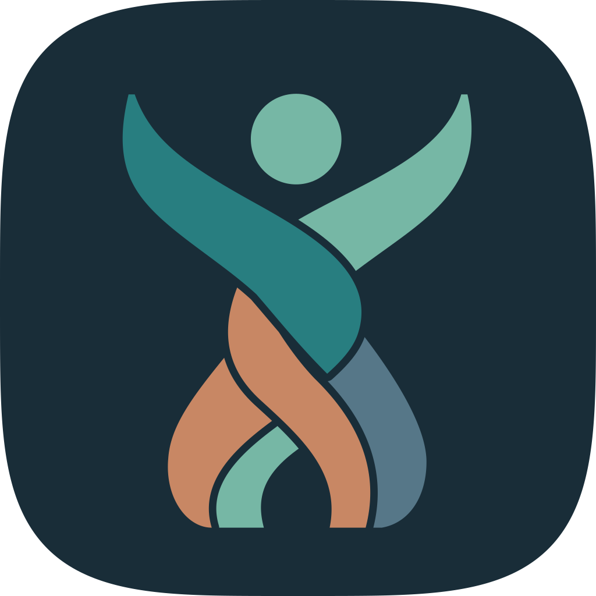
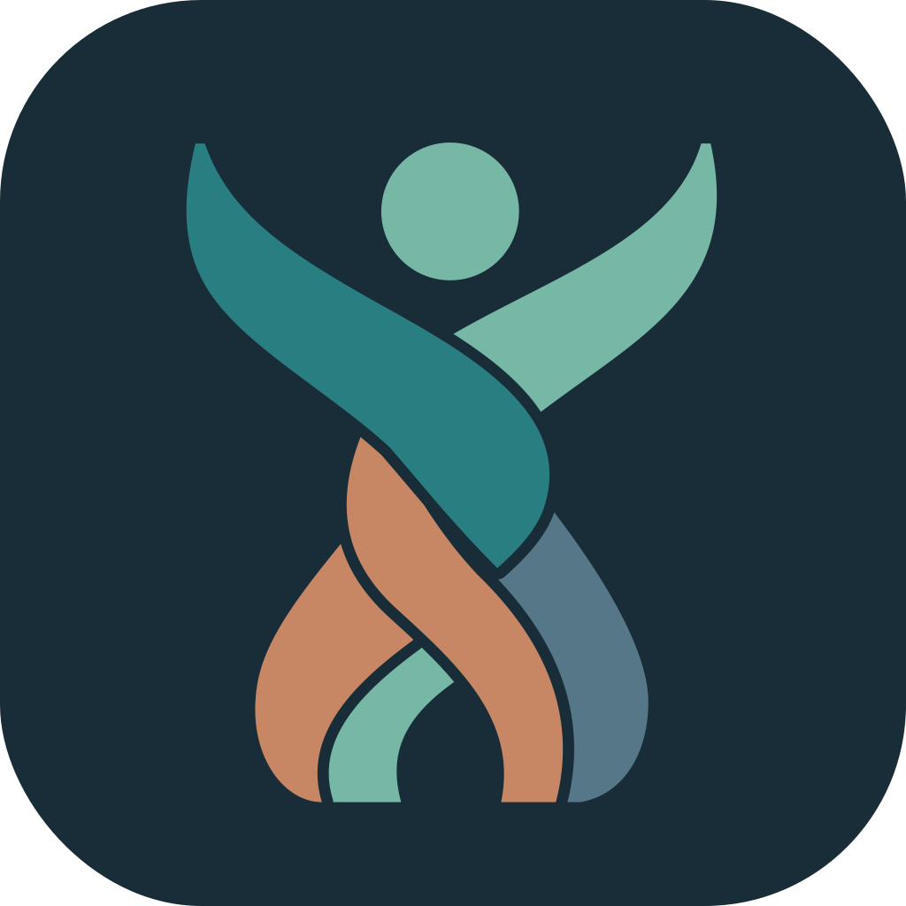
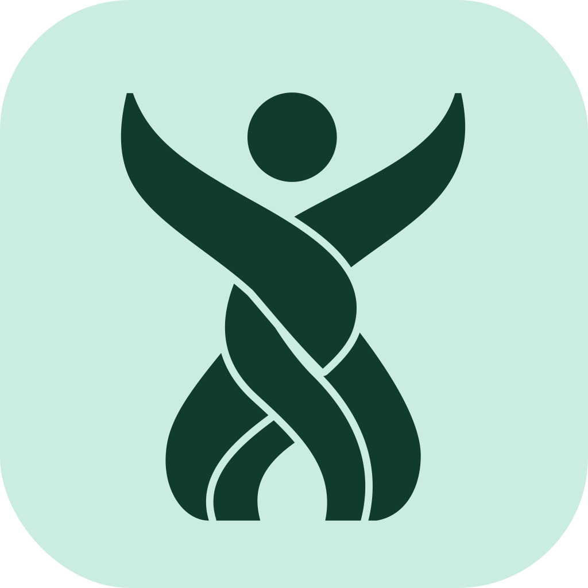
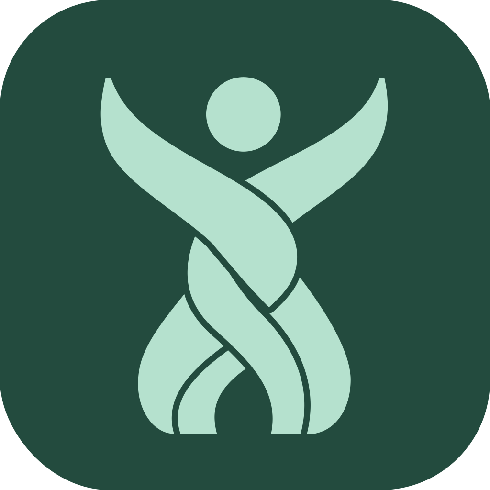
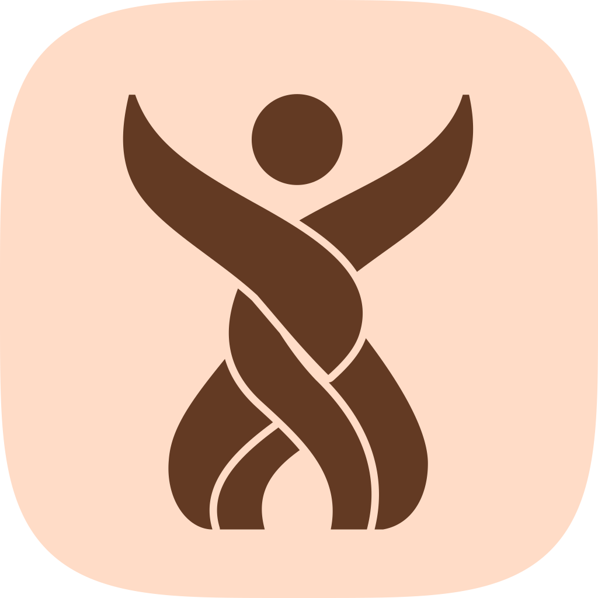
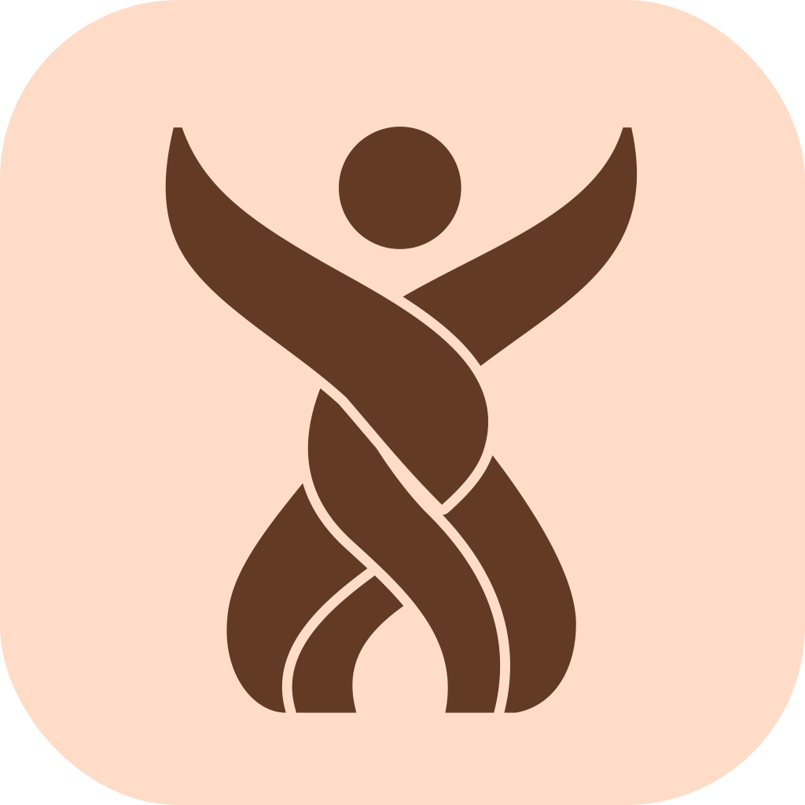
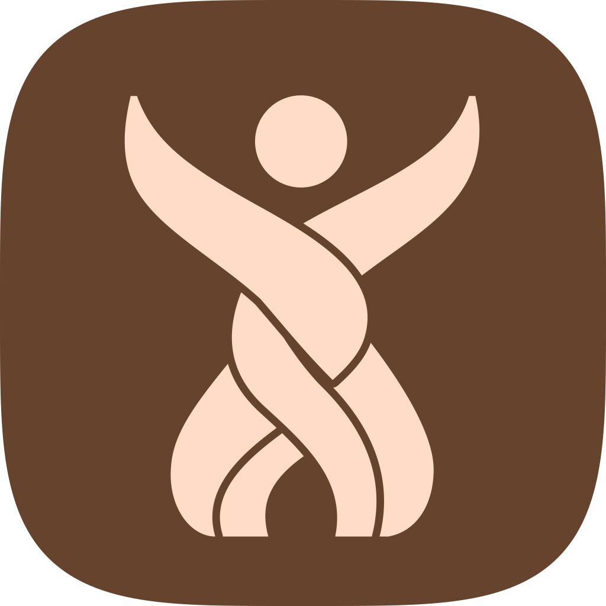
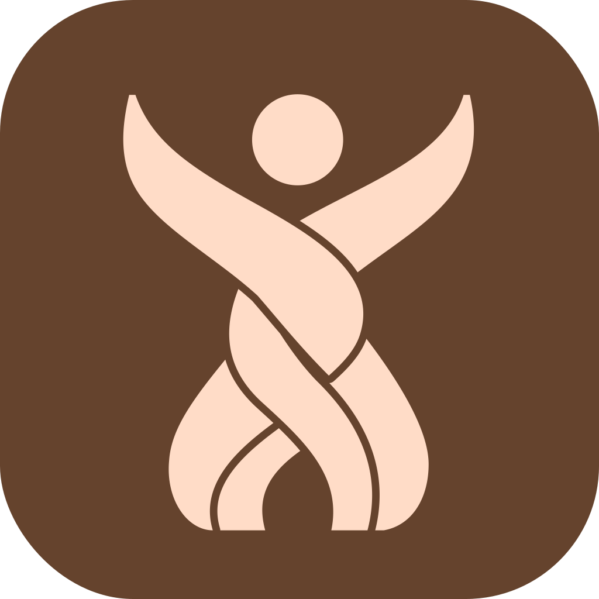
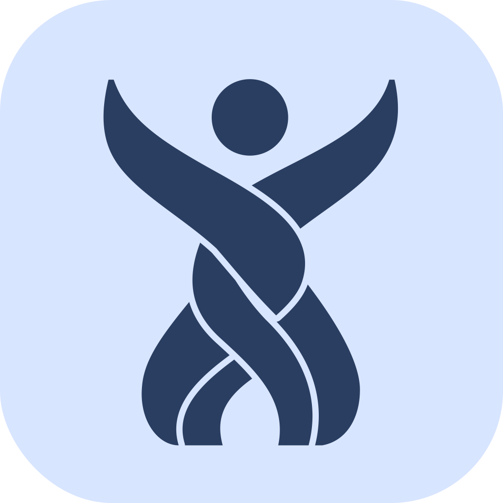
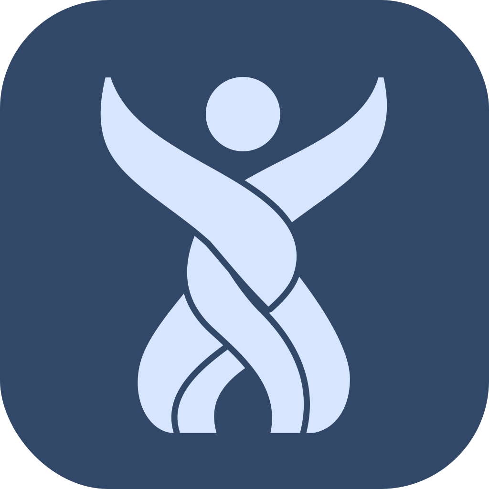

# Plectara brand kit

Status: Owner-approved iOS and Android icon treatments (2026-09-11); jade-head color standard retained
Version: 2.3.0

**Every full-color Plectara logo has a jade head (`#76B7A5`).** The woven figure keeps the same colors on light and dark backgrounds. Only the lettering changes: ink on light backgrounds, white on dark backgrounds. In a monochrome logo, the entire figure and lettering use one color.

[Download the complete brand kit](../../assets/brand/plectara-brand-kit.zip){ .md-button .md-button--primary download="plectara-brand-kit-v2.3.0.zip" }

Choose an example below and download its SVG or PNG. SVGs scale without losing sharpness; PNGs are ready for documents, presentations, and other tools that accept images. The logo samples have transparent backgrounds. The ivory and ink panels show how to place them; those panels are not part of the downloaded artwork.

## Adaptive Android icons

The woven figure now has a little more presence on Android: about 13% larger, with reviewed placement and the same original ribbons. Full color keeps the jade head on an ink background. The monochrome version lets the icon follow the user's home-screen theme.

[Download the Android icon package](../../assets/brand/plectara-android-icons.zip){ .md-button .md-button--primary download="plectara-android-icons-v2.3.0.zip" }

The package includes native Android resources, editable SVG sources, and 21 shape/theme examples at 1024, 192, and 48 px. **For an app, use the included `res/` files.** The SVG and PNG links below download appearance previews for presentations or review.

### Full color

Circle

[PNG · 1024 px](../../assets/brand/android-icons/plectara-full-color-circle-1024.png){ download="plectara-full-color-circle-1024.png" } · [SVG preview](../../assets/brand/android-icons/plectara-full-color-circle.svg){ download="plectara-full-color-circle.svg" }

Squircle

[PNG · 1024 px](../../assets/brand/android-icons/plectara-full-color-squircle-1024.png){ download="plectara-full-color-squircle-1024.png" } · [SVG preview](../../assets/brand/android-icons/plectara-full-color-squircle.svg){ download="plectara-full-color-squircle.svg" }

Rounded square

[PNG · 1024 px](../../assets/brand/android-icons/plectara-full-color-rounded-square-1024.png){ download="plectara-full-color-rounded-square-1024.png" } · [SVG preview](../../assets/brand/android-icons/plectara-full-color-rounded-square.svg){ download="plectara-full-color-rounded-square.svg" }

### Themed · Light

Circle

[PNG · 1024 px](../../assets/brand/android-icons/plectara-jade-light-circle-1024.png){ download="plectara-jade-light-circle-1024.png" } · [SVG preview](../../assets/brand/android-icons/plectara-jade-light-circle.svg){ download="plectara-jade-light-circle.svg" }

Squircle

[PNG · 1024 px](../../assets/brand/android-icons/plectara-jade-light-squircle-1024.png){ download="plectara-jade-light-squircle-1024.png" } · [SVG preview](../../assets/brand/android-icons/plectara-jade-light-squircle.svg){ download="plectara-jade-light-squircle.svg" }

Rounded square

[PNG · 1024 px](../../assets/brand/android-icons/plectara-jade-light-rounded-square-1024.png){ download="plectara-jade-light-rounded-square-1024.png" } · [SVG preview](../../assets/brand/android-icons/plectara-jade-light-rounded-square.svg){ download="plectara-jade-light-rounded-square.svg" }

### Themed · Dark

Circle

[PNG · 1024 px](../../assets/brand/android-icons/plectara-jade-dark-circle-1024.png){ download="plectara-jade-dark-circle-1024.png" } · [SVG preview](../../assets/brand/android-icons/plectara-jade-dark-circle.svg){ download="plectara-jade-dark-circle.svg" }

Squircle

[PNG · 1024 px](../../assets/brand/android-icons/plectara-jade-dark-squircle-1024.png){ download="plectara-jade-dark-squircle-1024.png" } · [SVG preview](../../assets/brand/android-icons/plectara-jade-dark-squircle.svg){ download="plectara-jade-dark-squircle.svg" }

Rounded square

[PNG · 1024 px](../../assets/brand/android-icons/plectara-jade-dark-rounded-square-1024.png){ download="plectara-jade-dark-rounded-square-1024.png" } · [SVG preview](../../assets/brand/android-icons/plectara-jade-dark-rounded-square.svg){ download="plectara-jade-dark-rounded-square.svg" }

Themed colors and shape masks are illustrative; Android and the launcher determine the final appearance. Jade is shown above. The same monochrome artwork also supports other light and dark theme colors.

??? tip "More theme colors · Clay and slate"

    **Clay · Light**

    

    

    
Circle

    

    

    

    [PNG · 1024 px](../../assets/brand/android-icons/plectara-clay-light-circle-1024.png){ download="plectara-clay-light-circle-1024.png" } · [SVG preview](../../assets/brand/android-icons/plectara-clay-light-circle.svg){ download="plectara-clay-light-circle.svg" }

    

    

    
Squircle

    

    

    

    [PNG · 1024 px](../../assets/brand/android-icons/plectara-clay-light-squircle-1024.png){ download="plectara-clay-light-squircle-1024.png" } · [SVG preview](../../assets/brand/android-icons/plectara-clay-light-squircle.svg){ download="plectara-clay-light-squircle.svg" }

    

    

    
Rounded square

    

    

    

    [PNG · 1024 px](../../assets/brand/android-icons/plectara-clay-light-rounded-square-1024.png){ download="plectara-clay-light-rounded-square-1024.png" } · [SVG preview](../../assets/brand/android-icons/plectara-clay-light-rounded-square.svg){ download="plectara-clay-light-rounded-square.svg" }

    

    

    **Clay · Dark**

    

    

    
Circle

    

    

    

    [PNG · 1024 px](../../assets/brand/android-icons/plectara-clay-dark-circle-1024.png){ download="plectara-clay-dark-circle-1024.png" } · [SVG preview](../../assets/brand/android-icons/plectara-clay-dark-circle.svg){ download="plectara-clay-dark-circle.svg" }

    

    

    
Squircle

    

    

    

    [PNG · 1024 px](../../assets/brand/android-icons/plectara-clay-dark-squircle-1024.png){ download="plectara-clay-dark-squircle-1024.png" } · [SVG preview](../../assets/brand/android-icons/plectara-clay-dark-squircle.svg){ download="plectara-clay-dark-squircle.svg" }

    

    

    
Rounded square

    

    

    

    [PNG · 1024 px](../../assets/brand/android-icons/plectara-clay-dark-rounded-square-1024.png){ download="plectara-clay-dark-rounded-square-1024.png" } · [SVG preview](../../assets/brand/android-icons/plectara-clay-dark-rounded-square.svg){ download="plectara-clay-dark-rounded-square.svg" }

    

    

    **Slate · Light**

    

    

    
Circle

    

    

    

    [PNG · 1024 px](../../assets/brand/android-icons/plectara-slate-light-circle-1024.png){ download="plectara-slate-light-circle-1024.png" } · [SVG preview](../../assets/brand/android-icons/plectara-slate-light-circle.svg){ download="plectara-slate-light-circle.svg" }

    

    

    
Squircle

    

    

    

    [PNG · 1024 px](../../assets/brand/android-icons/plectara-slate-light-squircle-1024.png){ download="plectara-slate-light-squircle-1024.png" } · [SVG preview](../../assets/brand/android-icons/plectara-slate-light-squircle.svg){ download="plectara-slate-light-squircle.svg" }

    

    

    
Rounded square

    

    

    

    [PNG · 1024 px](../../assets/brand/android-icons/plectara-slate-light-rounded-square-1024.png){ download="plectara-slate-light-rounded-square-1024.png" } · [SVG preview](../../assets/brand/android-icons/plectara-slate-light-rounded-square.svg){ download="plectara-slate-light-rounded-square.svg" }

    

    

    **Slate · Dark**

    

    

    
Circle

    

    

    

    [PNG · 1024 px](../../assets/brand/android-icons/plectara-slate-dark-circle-1024.png){ download="plectara-slate-dark-circle-1024.png" } · [SVG preview](../../assets/brand/android-icons/plectara-slate-dark-circle.svg){ download="plectara-slate-dark-circle.svg" }

    

    

    
Squircle

    

    

    

    [PNG · 1024 px](../../assets/brand/android-icons/plectara-slate-dark-squircle-1024.png){ download="plectara-slate-dark-squircle-1024.png" } · [SVG preview](../../assets/brand/android-icons/plectara-slate-dark-squircle.svg){ download="plectara-slate-dark-squircle.svg" }

    

    

    
Rounded square

    

    

    

    [PNG · 1024 px](../../assets/brand/android-icons/plectara-slate-dark-rounded-square-1024.png){ download="plectara-slate-dark-rounded-square-1024.png" } · [SVG preview](../../assets/brand/android-icons/plectara-slate-dark-rounded-square.svg){ download="plectara-slate-dark-rounded-square.svg" }

    

    

??? info "Using the icons in an Android app"

    Replace the matching launcher resources with the ZIP's `res/` files, resolving existing definitions first. Remove old density-specific `plectara_foreground.png` files when adopting the vector of the same name; those bitmaps can otherwise override it.

    Keep `android:icon="@mipmap/ic_launcher"` and `android:roundIcon="@mipmap/ic_launcher_round"` in the app manifest. Compile with API 33 or newer for the monochrome element. The package provides adaptive definitions for Android 8+, themed definitions for Android 13+, and standard/round legacy PNGs in five densities.

    The foreground and monochrome layers remain unmasked. Let the system apply the mask and themed colors. Check actual launchers, supported Android versions, and small-size rendering in the consuming app.

    [Android adaptive icon guidance](https://developer.android.com/develop/ui/compose/system/icon_design_adaptive)

This release publishes the approved assets in PL-OS. App integration is a separate step. [Read the v2.3.0 release notes](../../releases/v2.3.0/README.md).

## Liquid Glass iOS icons

The woven figure now has an approved native Liquid Glass treatment. Default and dark appearances retain the jade head and ribbon palette; clear and tinted appearances use the same figure with system-managed monochrome materials.

[Download the iOS icon package](../../assets/brand/plectara-ios-liquid-glass.zip){ .md-button .md-button--primary download="plectara-ios-liquid-glass-v2.2.0.zip" }

The package includes the editable Icon Composer document, seven original SVG layers, and all six appearances as PNGs at 1024, 180, and 60 px. **For an app, use the included `Plectara.icon` document.** Choose a PNG below for a presentation or design review.

### Default

[Download 1024 px PNG](../../assets/brand/ios-liquid-glass/plectara-ios-default-1024.png){ download="plectara-ios-default-1024.png" }

### Clear · Light

[Download 1024 px PNG](../../assets/brand/ios-liquid-glass/plectara-ios-clear-light-1024.png){ download="plectara-ios-clear-light-1024.png" }

### Tinted · Light

[Download 1024 px PNG](../../assets/brand/ios-liquid-glass/plectara-ios-tinted-light-1024.png){ download="plectara-ios-tinted-light-1024.png" }

### Dark

[Download 1024 px PNG](../../assets/brand/ios-liquid-glass/plectara-ios-dark-1024.png){ download="plectara-ios-dark-1024.png" }

### Clear · Dark

[Download 1024 px PNG](../../assets/brand/ios-liquid-glass/plectara-ios-clear-dark-1024.png){ download="plectara-ios-clear-dark-1024.png" }

### Tinted · Dark

[Download 1024 px PNG](../../assets/brand/ios-liquid-glass/plectara-ios-tinted-dark-1024.png){ download="plectara-ios-tinted-dark-1024.png" }

These previews come from Apple's Icon Composer renderer. PNGs have transparent outer corners and a flattened icon tile; the clear PNG does not dynamically refract a background. The native icon adapts to system lighting and appearance settings. Jade tint is shown as an example; people choose their Home Screen tint.

??? info "Using the icon in Xcode"

    Extract the ZIP and add the entire `Plectara.icon` document to your iOS application target. Set the target's **App Icons and Launch Screen → App Icon** name to **Plectara**, without the extension. Open the document in Icon Composer to inspect or adjust its layers.

    Use the native document for the app; the rounded PNG previews are for review and communications. The complete brand kit still includes the legacy `AppIcon.appiconset` for older workflows. Verify the integration on your supported iOS versions and devices.

    [Apple's Icon Composer instructions](https://developer.apple.com/documentation/xcode/creating-your-app-icon-using-icon-composer)

The Liquid Glass treatment is specific to system app icons. Use the flat logo masters below for website, document, and in-app branding. [Read the v2.2.0 release notes](../../releases/v2.2.0/README.md).

## Logos with lettering

Use these horizontal logos for website headers, documents, presentations, and marketing. Each PNG is 940 × 295 px. Keep the original proportions and spacing when resizing.

### Full color · light background

Jade head and four colored strands, with ink (`#192D38`) lettering. Use on white or ivory.

[Download SVG](../../assets/brand/plectara-horizontal.svg){ download="plectara-horizontal.svg" } · [Download PNG](../../assets/brand/plectara-horizontal.png){ download="plectara-horizontal.png" }

### Full color · dark background

The same jade head and colored strands, with white (`#FFFFFF`) lettering. Use on ink or a clear, approved dark background.

[Download SVG](../../assets/brand/plectara-horizontal-reversed.svg){ download="plectara-horizontal-reversed.svg" } · [Download PNG](../../assets/brand/plectara-horizontal-reversed.png){ download="plectara-horizontal-reversed.png" }

### Monochrome · ink

The head, every strand, and the lettering are ink (`#192D38`). Use for one-color reproduction on light backgrounds.

[Download SVG](../../assets/brand/plectara-horizontal-ink.svg){ download="plectara-horizontal-ink.svg" } · [Download PNG](../../assets/brand/plectara-horizontal-ink.png){ download="plectara-horizontal-ink.png" }

### Monochrome · white

The head, every strand, and the lettering are white (`#FFFFFF`). Use for one-color reproduction on dark backgrounds. The gaps remain transparent.

[Download SVG](../../assets/brand/plectara-horizontal-white.svg){ download="plectara-horizontal-white.svg" } · [Download PNG](../../assets/brand/plectara-horizontal-white.png){ download="plectara-horizontal-white.png" }

## Standalone symbols

Use the figure by itself when the Plectara identity is already clear. Full color always keeps its jade head; monochrome changes the entire figure to ink or white. Each PNG is 340 × 410 px.

### Full color

[Download SVG](../../assets/brand/plectara-symbol.svg){ download="plectara-symbol.svg" } · [Download PNG](../../assets/brand/plectara-symbol.png){ download="plectara-symbol.png" }

### Ink

[Download SVG](../../assets/brand/plectara-symbol-ink.svg){ download="plectara-symbol-ink.svg" } · [Download PNG](../../assets/brand/plectara-symbol-ink.png){ download="plectara-symbol-ink.png" }

### White

[Download SVG](../../assets/brand/plectara-symbol-white.svg){ download="plectara-symbol-white.svg" } · [Download PNG](../../assets/brand/plectara-symbol-white.png){ download="plectara-symbol-white.png" }

## Lettering standards

The Plectara wordmark is custom outlined artwork. Use the supplied files, including when the lettering appears without the figure. Preserve the original letter shapes, capitalization, spacing, proportions, and alignment. Do not type “Plectara” in Inter or another font to recreate the logo, adjust individual letters, or recolor the lettering jade.

| Placement | Lettering | Figure |
| --- | --- | --- |
| White or ivory background | Ink `#192D38` | Jade head; original strand colors |
| Ink or another approved dark background | White `#FFFFFF` | Jade head; original strand colors |
| One-color use on a light background | Ink `#192D38` | Entire figure ink |
| One-color use on a dark background | White `#FFFFFF` | Entire figure white |

### Ink lettering

[Download SVG](../../assets/brand/plectara-wordmark.svg){ download="plectara-wordmark.svg" } · [Download PNG](../../assets/brand/plectara-wordmark.png){ download="plectara-wordmark.png" }

### White lettering

[Download SVG](../../assets/brand/plectara-wordmark-white.svg){ download="plectara-wordmark-white.svg" } · [Download PNG](../../assets/brand/plectara-wordmark-white.png){ download="plectara-wordmark-white.png" }

Inter is the separate UI and supporting-copy typeface. The optional campaign line “A healthier whole” uses supporting typography and is not part of the logo. PL-OS uses the Plectara identity; do not replace the logo lettering with “PL-OS.” See [Typography](typography.md) for the UI type standards.

## Other ready-to-use assets

| Asset | Use | Downloads |
| --- | --- | --- |
| Stacked color logo | Portrait layouts on light backgrounds; jade head and ink lettering | [SVG](../../assets/brand/plectara-stacked.svg){ download="plectara-stacked.svg" } · [PNG](../../assets/brand/plectara-stacked.png){ download="plectara-stacked.png" } |
| Square app icon | Opaque 1024 × 1024 source for platform masking | [SVG](../../assets/brand/plectara-app-icon.svg){ download="plectara-app-icon.svg" } · [PNG](../../assets/brand/plectara-app-icon.png){ download="plectara-app-icon.png" } |
| Rounded avatar | Social profiles; jade head on ink | [SVG](../../assets/brand/plectara-avatar.svg){ download="plectara-avatar.svg" } · [PNG](../../assets/brand/plectara-avatar.png){ download="plectara-avatar.png" } |

The complete ZIP also includes platform icon sizes, a favicon, web manifest, iOS asset catalog, Android resources, social graphics, Inter and its license, design tokens, and an asset inventory.

## Placement and clear space

Allow one head diameter of clear space around the standalone symbol and half a head diameter around a logo with lettering. Prefer 32 px or larger for the full woven symbol and at least 140 px wide for the horizontal logo. At 16 px, the favicon communicates silhouette only.

Use a clear background and check the logo at its intended display size. If the full-color figure loses definition, increase its size, choose a clearer background, or use the complete monochrome version. Keep the full-color head jade in every case. Do not add outlines, shadows, gradients, or other effects to flat logo masters. The approved native iOS icon uses system-rendered materials; its clear and tinted modes render the complete figure monochromatically.

## Source artwork and regeneration

Editable SVG masters live in `assets/brand/plectara/source/`, with generated PNGs in `assets/brand/plectara/png/`. The original reference PNG is retained for provenance only; it predates the jade-head standard and is not a current production asset. The owner-approved geometry, six-unit strand clearances, and outlined lettering from 2026-09-04 remain the construction baseline. The 2026-09-07 color standard supersedes the ink-headed full-color variant.

Install `tooling/requirements-brand.txt`, then run `python tooling/build-plectara-tokens.py`, `python tooling/build-plectara-brand.py`, and `python tooling/validate-brand.py`. The build regenerates the site downloads, brand board, inventory, and ZIP. Add `--render-ios` to the brand build on a Mac with Xcode and Icon Composer to refresh all native iOS previews; ordinary builds reuse the checked-in renders. CairoSVG also requires a system Cairo library.

Normal builds reuse `source/plectara-wordmark.svg`. Do not retrace or substitute the lettering during ordinary exports. Explicit wordmark recovery uses `--retrace-wordmark` under Python 3.12; the installed VTracer build crashes under Python 3.14.

See [Logo System](logo-system.md), [Logo Usage](logo-usage.md), and the [v2.1.0 migration notes](../../releases/v2.1.0/README.md).
