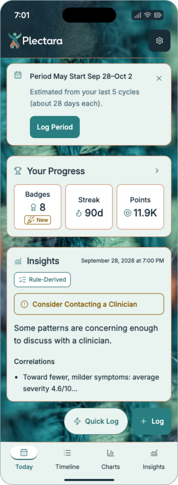
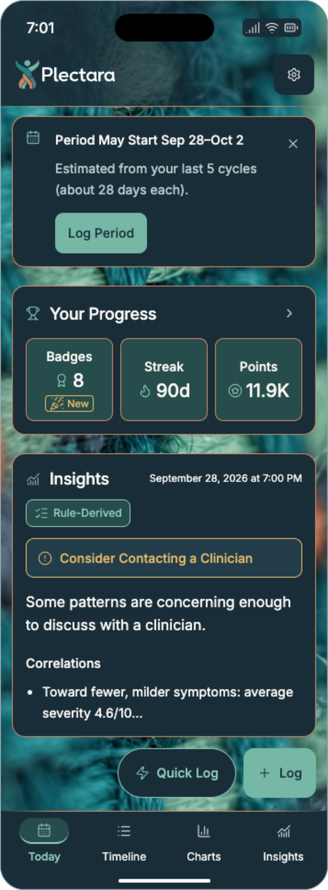
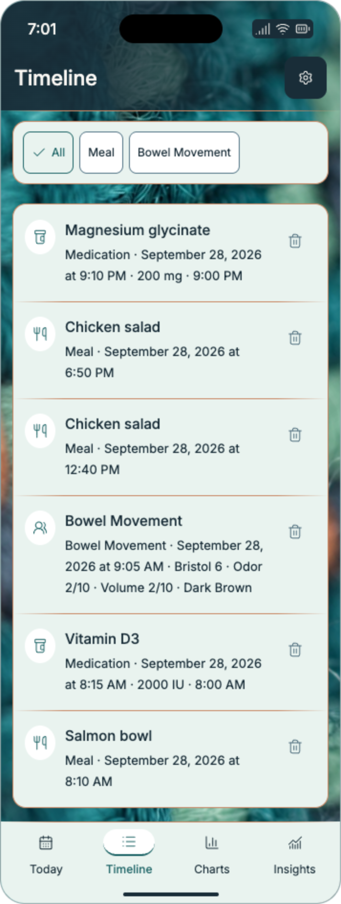
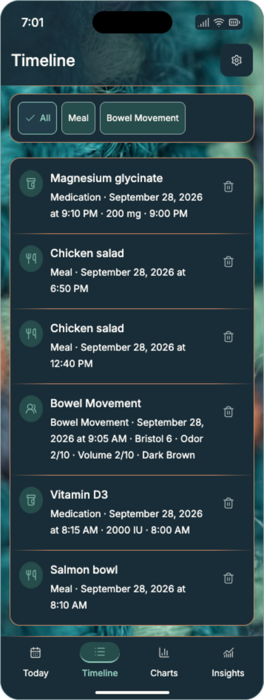
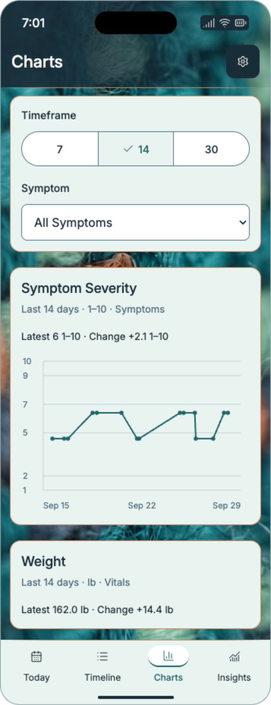
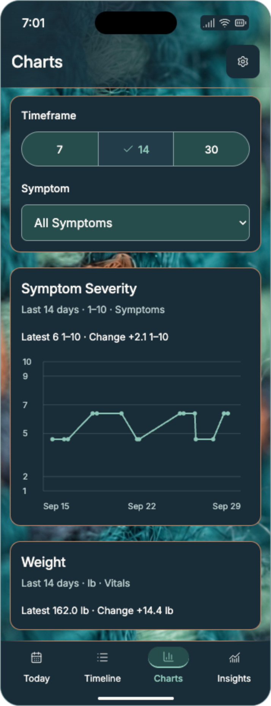
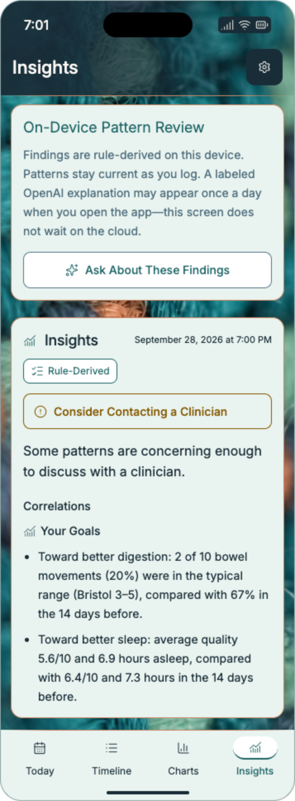
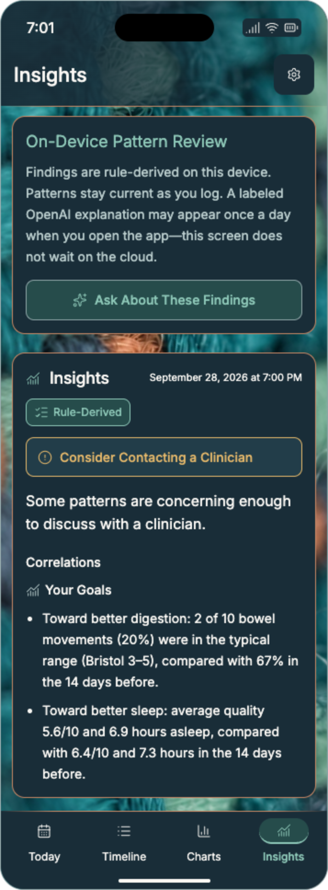

# App Visual Specification

Status: Approved for PL-OS v2.6.0
Owner: Design System Working Group
Version: 2.6.0
Last updated: 2026-09-28
Decision: [ADR-0014](../../adr/0014-adopt-woven-app-visuals.md)

## Approved direction

Extend the approved widget identity into the Plectara app: one vibrant woven-yarn backdrop, a horizontally shaded header, soft copper horizontal rules, mint reading cards in light mode, and opaque ink reading cards in dark mode. Keep the exact canonical logo and yarn artwork. The app's content and controls follow the owner-supplied Today, Timeline, Charts, and Insights screenshots.

The owner approved the four-screen review and requested PL-OS integration with screenshots and affected standards. These are browser-rendered design references. They define the visual direction; native implementation, real device dimensions, health calculations, and accessibility release evidence belong to the consuming app.

[Download the app visual kit](../../assets/app/plectara/plectara-app-visuals-v1.zip){ .md-button .md-button--primary download="plectara-app-visuals-v1.zip" }
[Open the offline-capable reference](../../assets/app/plectara/reference/approved-app.html){ .md-button }
[View the asset manifest](../../assets/app/plectara/manifest.json){ .md-button }

The kit includes the approved editable reference, eight populated-screen PNGs, two empty Today PNGs, four comparison sheets, exact source/delivery textures, canonical logo, fonts and licenses, local design values, CSS/Flutter color adapters, written specification, provenance, and verification records.

## Screenshot gallery

Screenshots use a 357-unit illustrative phone width at 2× export scale. Heights grow to show readable content; the references are not fixed-height device captures. Source records and medical language are review fixtures copied from owner-supplied screenshots. Their origin is not established as a clinical or synthetic dataset. They must never seed production accounts or become health-calculation rules.

**Today · Light**

[{ width="357" }](../../assets/app/plectara/previews/today-light.png)

**Today · Dark**

[{ width="357" }](../../assets/app/plectara/previews/today-dark.png)

**Timeline · Light**

[{ width="357" }](../../assets/app/plectara/previews/timeline-light.png)

**Timeline · Dark**

[{ width="357" }](../../assets/app/plectara/previews/timeline-dark.png)

**Charts · Light**

[{ width="357" }](../../assets/app/plectara/previews/charts-light.png)

**Charts · Dark**

[{ width="357" }](../../assets/app/plectara/previews/charts-dark.png)

**Insights · Light**

[{ width="357" }](../../assets/app/plectara/previews/insights-light.png)

**Insights · Dark**

[{ width="357" }](../../assets/app/plectara/previews/insights-dark.png)

Comparison sheets: [Today](../../assets/app/plectara/previews/today-comparison.png), [Timeline](../../assets/app/plectara/previews/timeline-comparison.png), [Charts](../../assets/app/plectara/previews/charts-comparison.png), and [Insights](../../assets/app/plectara/previews/insights-comparison.png). Empty Today references: [light](../../assets/app/plectara/previews/today-empty-light.png) and [dark](../../assets/app/plectara/previews/today-empty-dark.png).

## Composition and layer order

1. Opaque ink foundation beneath the photo.
2. One full-opacity yarn image covering the shell behind the header and content.
3. Horizontal ink shading within the header.
4. The canonical logo on Today, or the current page title on Timeline, Charts, and Insights; settings remains on the right.
5. A soft copper rule between header and content.
6. Opaque themed cards and control backgrounds carrying live text, icons, values, and chart marks.
7. Persistent bottom navigation with a second soft copper rule and a non-color selected cue.
8. Native overlays with opaque reading surfaces and a scrim behind them.

Do not wash out the photo in light mode, tile it, split it into separate header/body images, or blur live text. The existing gentle focus progression belongs to the supplied photo. Daily screen branding is an approved shell treatment under [ADR-0014](../../adr/0014-adopt-woven-app-visuals.md); repeated content remains visually quiet.

The dark app uses opaque reading cards. The [capture widgets](capture-widget-visuals.md) retain their separately approved transparent dark action grouping. Apply the appropriate component contract.

## Header, texture, and horizontal rules

Use [the full-color reversed logo](../../assets/app/plectara/logos/plectara-horizontal-reversed.svg) on Today. Preserve the jade head, white outlined lettering, geometry, spacing, and proportions. The other three screens use their actual page titles without adding a duplicate logo, greeting, date, or dashboard heading.

The header shades from darker left to brighter right. Ink `#192D38` opacity stops, measured left → right, are: **0% 96%; 20% 92%; 38% 82%; 56% 66%; 80% 22%; 100% 8%**. Protect the actual title/logo bounds. Longer localized or scaled text must receive extended shading or opaque ink backing rather than entering the brighter image. Settings and preview status icons use ink backing. Native system bars follow actual safe areas and platform appearance; do not recreate a Dynamic Island, battery, clock, or device mask in product content.

The horizontal rule is 1 reference unit high: copper `#C88764`, transparent at 0%, full copper at 16%–84%, transparent at 100%. It is a decorative separator. Required control outlines and focus cues use their separately tested roles.

Use the exact [900 × 700 delivery WebP](../../assets/app/plectara/textures/plectara-widget-yarn-gentle-focus-v1.webp) or prepare native encodings from the exact [1422 × 1106 PNG](../../assets/app/plectara/textures/plectara-widget-yarn-gentle-focus-v1.png). Both are the approved saved widget texture, reused without regeneration. See [provenance](../../assets/app/plectara/source/provenance.md) and the [original approval manifest](../../assets/app/plectara/source/approved-pattern-manifest.json).

The preview rotates a centered image layer 55° clockwise, with `cover` scaling and left/center placement. For shell width `W` and height `H`, its expanded unrotated layer is:

- Width: `W × cos(55°) + H × sin(55°) + 32`
- Height: `W × sin(55°) + H × cos(55°) + 32`

The final 32 units provide cover margin. Recalculate when bounds change; native implementations may use equivalent crop math. Maintain image proportions, cover every corner, and preserve the recognizable weave. Header-only yarn and lifted dark cards are review alternatives, not the adopted default.

## App-local colors

The [app design values](../../assets/app/plectara/app-visual-tokens.json) define these component aliases. Foundation colors and existing shared adapters continue to govern other components. The app-local control outline and attention tones below are deliberate, measured variants.

| Role | Light | Dark |
| --- | --- | --- |
| Reading card / navigation | Mint `#E9F3EF` | Ink `#192D38` |
| Main text | Ink `#192D38` | Ivory `#FAF8F4` |
| Supporting text / chart labels | `#506F7E` | `#B8CBCB` |
| Progress tiles / fields / outlined action backing | White `#FFFFFF` | `#264C4B` |
| Selected filter / timeframe fill | Mint `#E9F3EF` | Lifted ink `#223D49` |
| Selected navigation icon backing | White | `#264C4B` |
| Filled Log / Log Period | Teal `#287E80`, white foreground | Jade `#76B7A5`, ink foreground |
| Links, selected text and default screenshot chart series | `#206668` | `#8DC7B7` |
| Required control outline | Slate `#567788` | `#8DA4A6` |
| Decorative card / tile outline | Copper `#C88764` | Copper |
| Attention label / icon | `#845800` | `#E5B86A` |
| Attention backing | Mint | Lifted ink `#223D49` |

Copper edges frame reading groups and display-only progress tiles. They do not identify inputs, interactive boundaries, selection, or keyboard focus. White against mint is insufficient as a required boundary on its own; controls retain their tested outline, label, check, or other indicator.

Use semantic success, critical, information, and AI roles from the foundation palette for states not shown here. Source badges distinguish **Rule-Derived** findings from explicitly labeled AI-generated output. The teal **Ask About These Findings** action is permitted; purple remains reserved for AI-specific meaning and is not required on every AI entry point.

## Geometry and typography

Reference dimensions are logical composition values, not universal device dimensions. Record local exceptions through [app-visual-tokens.json](../../assets/app/plectara/app-visual-tokens.json) instead of silently changing the shared scale.

| Element | Reference |
| --- | --- |
| Body gutter / section gap | 12 / 20 |
| Body top / bottom inset | 10 / 14 |
| Card padding / radius / outline | 14 / 14 / 1 |
| Progress tile gap / radius / minimum height | 8 / 9 / 88 |
| Filled button radius | 9 |
| Log / Quick Log radius | 12 / 28 |
| Control target / floating action height | At least 44 / 54 |
| Main heading / card heading | 22/30 at weight 500 / 18/25 at weight 500 |
| Body / finding summary | 14/23 at weight 400 / 16/25 at weight 400 |
| Timeline title / metadata | 15/22 at weight 500 / 13/22 at weight 400 |
| Navigation / chart and timestamp labels | 12/18 / 11 minimum in the browser reference |

Use Inter with the approved native/system fallbacks. The logo is artwork, not typeset UI. Native text uses scalable text styles and must reflow; a screenshot's small timestamp or chart label is not a fixed production cap. Use iOS 44 pt and Android 48 dp targets as specified in [Dark Mode & Accessibility](dark-mode.md). Device masks, browser captions, 2× export scale, and the 26-unit outer preview radius are presentation context.

Progress metric tiles are an approved bounded exception to the general no-nested-cards rule: three display-only values inside **Your Progress**, with no independent page/card actions. Other reading sections do not nest decorative cards.

## Screen contracts

### Today

The header uses only the Plectara lockup and settings action. Bottom navigation is **Today, Timeline, Charts, Insights**, in that order. Preserve the actual current state rather than filling the screen with fabricated favorites, sleep summaries, meal cards, or unrelated scores.

For the populated screenshot, the visible order is:

1. Optional period reminder with calendar icon, **Period May Start Sep 28–Oct 2**, estimation context, dismiss action, and **Log Period**.
2. **Your Progress** with Badges **8** and **New**, Streak **90d**, and Points **11.9K**.
3. **Insights** with timestamp, **Rule-Derived** source badge, attention notice, supporting copy, and **Correlations** excerpt.
4. Outlined **Quick Log** and filled **Log** actions.

For the earlier empty screenshot, preserve **Your Progress** (0, 0d, 0), **Insights** learning copy, **Today's Logs** with its **Log entry** action, and **Last 14 Days** totals. The totals are Meal, Bowel movement, Symptom, Sleep, Vitals, and Activity, each 0 in that fixture. Zero counts represent no logged entries; missing health measurements must remain unavailable rather than becoming zero values.

The period reminder and **Log Period** appear only when supported by real feature state. The global **Log** action is the stable logging entry point, **Quick Log** is secondary, and the reminder's filled action is contextual. This is an approved Today-specific action-hierarchy exception. Position floating actions above native bottom navigation with safe-area clearance and reserve enough content inset that they cannot cover warnings, evidence, or editable content.

The source Today insight was partially obscured and truncated. The review preserves the visible beginning, “Toward fewer, milder symptoms: average severity 4.6/10…”. It does not establish the hidden continuation. Production must use the complete real finding, readable truncation/disclosure, and existing evidence behavior.

### Timeline

Use the Timeline title and settings action. Keep the category filter row immediately before the ordered list. The supplied visible filters are **All**, **Meal**, and **Bowel Movement**; All has a check and selected appearance. This screenshot is not the full log-type/filter catalog.

Use one opaque reading panel for the collection, leading category icons, primary entry names, readable multiline metadata, explicit labeled delete controls, and soft copper row rules. Preserve the screenshot order: Magnesium glycinate, Chicken salad at 6:50 PM, Chicken salad at 12:40 PM, Bowel Movement, Vitamin D3, Salmon bowl. Medication details, units, timestamps, and bowel metadata are fixture content, not newly approved tracking requirements.

Allow filters to wrap or use a supported accessible overflow pattern. Keep long medication names and dates readable. Retain the app's actual edit, confirmation, undo, permission, loading, and empty behavior; a local preview's delete dialog is not a production workflow specification.

### Charts

Use the Charts title and settings action. Keep **Timeframe** with **7 / 14 / 30** options, **14** selected with a check, and the labeled **Symptom / All Symptoms** selector. The reference does not define the unseen selector options.

The visible sections are **Symptom Severity** followed by **Weight**. Preserve units, time ranges, latest values, and change labels. Screenshot fixture summaries are **Latest 6 1–10 · Change +2.1 1–10** and **Latest 162.0 lb · Change +14.4 lb** for 14 days.

Put chart marks and labels on an opaque card. Use the local tested link tone for the default screenshot series, with solid lines and circle markers. Grid lines are quiet decorative structure; essential baselines/thresholds need sufficient contrast. Provide the represented data and an accessible summary in the consuming app. Keep terminal axis labels within the plot bounds, including Sep 29.

The symptom line was reconstructed visually from the screenshot; it is not an exact exported time series. The weight graph was below the visible area and is not invented in this reference. Real application data drives production charts and changed timeframes.

### Insights

Use the Insights title and settings action. Preserve **On-Device Pattern Review**, the rule-derived/device explanation, and **Ask About These Findings** above the findings card. The screenshot's explanation refers to optional, labeled OpenAI text; the underlying [local-findings decision](../../adr/0010-hybrid-local-findings-optional-llm.md) continues to define behavior.

The findings card keeps its timestamp, **Rule-Derived** badge, **Consider Contacting a Clinician** notice, supporting copy, **Correlations**, and **Your Goals** sections. Use an attention-colored outline/icon/label on an opaque themed backing. The notice reflects existing application rule state; this visual standard defines no clinical thresholds, diagnoses, or treatment recommendations.

Keep the screenshot's digestion and sleep comparisons as review copy. In production, all percentages, units, baselines, and time periods derive from the user's actual evidence and retain source, missing-data, and limitation context. Longer findings expand naturally; warnings and source context must remain visible before or beside the claim they qualify.

## Scope, states, and migration

The reference's appearance dialog, progress dialog, local deletion, and timeframe/filter demonstrations support visual review only. Log, Quick Log, Log Period, and Ask About These Findings are visual entry points; this kit does not implement their flows. Settings, Capture forms, reports, and other routes inherit the shell and tested reading surfaces while retaining their existing feature contracts. Obtain screen review for layouts not represented here.

1. Add the supplied texture as one decorative shell layer; respect safe areas and actual native content bounds.
2. Introduce app-local color/geometry aliases from this kit alongside the existing foundation tokens. Use the [CSS](../../assets/app/plectara/adapters/plectara-app-colors.css) and [Flutter](../../assets/app/plectara/adapters/plectara_app_colors.dart) adapters as mapping examples.
3. Reuse shared components for the header, themed reading cards, soft copper rule, progress group, outlined filters, list rows, charts, and bottom navigation.
4. Preserve real route labels, screen order, capture actions, source badges, evidence, health-rule state, and theme preference. Default native appearance to System, with explicit Light/Dark overrides.
5. Apply the same readable surfaces to loading, empty, error, stale, permission-limited, and offline states. Retain normal contrast for unselected, enabled, and read-only content.
6. Check state layers, focus, overlays, large text, localization, reduced motion/transparency, high contrast, and action clearance in native UI. Omit decorative yarn when the platform's accessibility treatment requires a quieter background.
7. Record real app/device and assistive-technology evidence under the existing engineering release rules.

## Verification and acceptance

The kit supplies [browser layout evidence](../../assets/app/plectara/verification/browser-review.json), an [offline reference check](../../assets/app/plectara/verification/offline-review.json), and [58 measured color pairs](../../assets/app/plectara/verification/contrast-report.json). Ordinary text targets 4.5:1 and required non-text cues 3:1 under the existing [accessibility contract](dark-mode.md). Header measurements composite the protected ink shade over a conservative white base; actual crops and scaled/localized bounds still need rendered verification.

- All four views match the visible source content, headings, controls, and navigation; both themes expose the same tasks and evidence.
- The vibrant finite yarn, horizontal header shade, canonical logo, opaque reading cards, and soft copper rules reproduce the approved direction.
- Required outlines and selected/focus cues remain distinguishable; copper is decorative. Yarn is hidden from assistive technology.
- Browser export checks cover 736- and 320-unit review widths, loaded icons/fonts, local navigation/filter/timeframe behavior, and absence of horizontal overflow. These results do not establish native or ADA compliance.
- Individual PNGs, reference files, exact textures/logo, licenses, and design values have dimensions and SHA-256 checksums; the source, documentation mirror, and downloadable ZIP agree.
- Native text, controls, safe areas, real data, app state, warnings, theme switching, and VoiceOver/TalkBack behavior are verified before an app release.

## Version history

- v2.6.0: Adds the owner-approved screenshot-matched app visual standard and reference kit.

See [RFC-0008](../../rfc/0008-woven-app-visuals.md), [ADR-0014](../../adr/0014-adopt-woven-app-visuals.md), and [v2.6.0 release notes](../../releases/v2.6.0/README.md).
