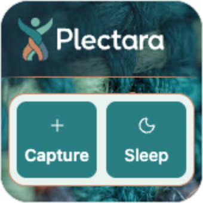
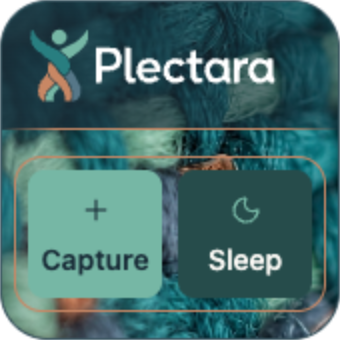
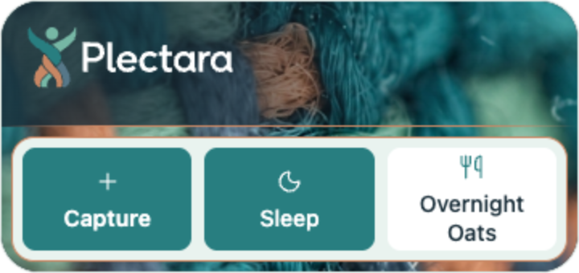
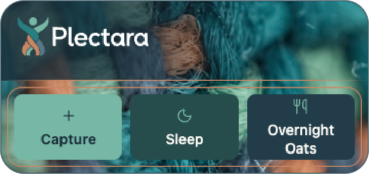
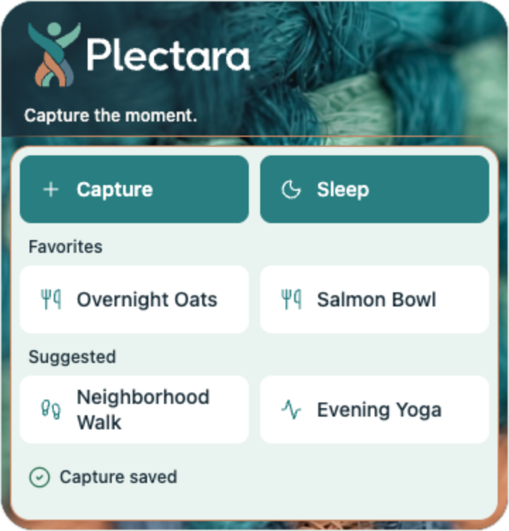
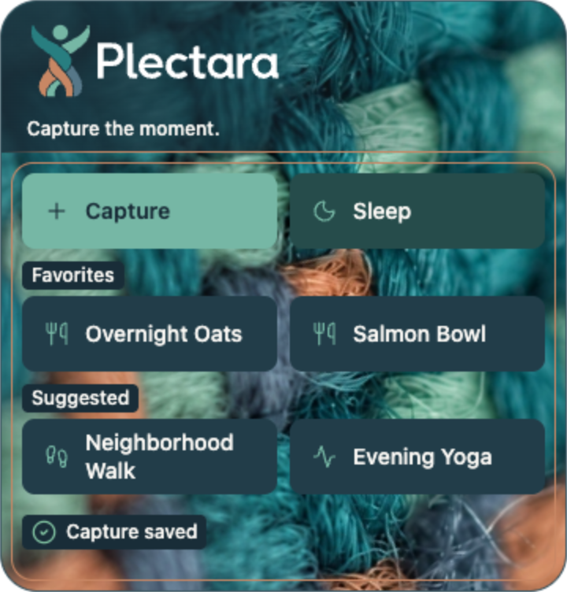
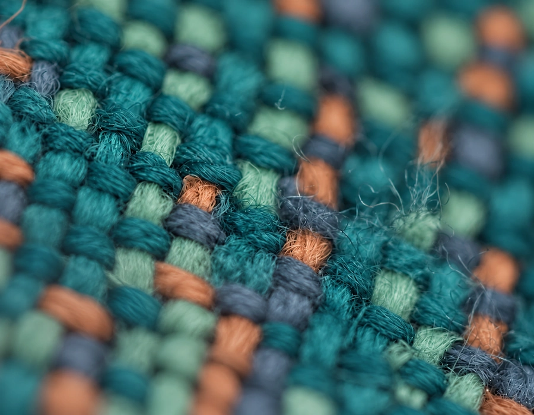
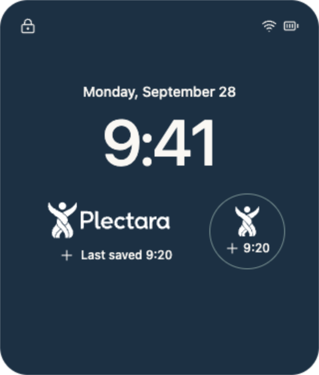

# Capture Widget Visual Specification

Status: Released standard; native implementation pending
Owner: Design System Working Group
Version: 2.5.0
Last updated: 2026-09-28

## Approved direction

Use the approved woven yarn photograph across the entire home screen widget. Keep the yarn vibrant in both branded themes. A horizontal ink gradient protects the canonical Plectara logo; a soft copper rule separates the header from the actions. Put all body controls inside one card: mint in light mode and transparent with a copper outline in dark mode.

This specification records the final owner-approved mockup, revision 13. The light Capture and Sleep buttons share a teal fill and white foreground. Quick button labels use title case. The Large widget has saved confirmation and **no Edit button**. The [Capture Widgets standard](capture-widgets.md) defines the surrounding behavior and privacy rules.

These are browser-rendered design references, not screenshots of a shipped native widget. Host dimensions, system appearances, and accessibility must be checked in the native implementation.

[Download the complete widget kit](../../assets/widgets/plectara/plectara-capture-widgets-v1.zip){ .md-button .md-button--primary download="plectara-capture-widgets-v1.zip" }
[Open the browser reference](../../assets/widgets/plectara/reference/approved-widgets.html){ .md-button }

The kit includes individual PNG screenshots, full resolution and delivery textures, canonical logo copies, Inter and its license, design values, an editable HTML reference, written specifications, provenance, and verification records. Its [manifest](../../assets/widgets/plectara/manifest.json) lists dimensions and SHA-256 checksums.

## Screenshot gallery

PNG screenshots are exported at 2× the illustrative canvas size, with transparent outer corners. Click a screenshot to open the full image. Favorite and Suggested names are fixtures for review; the production app supplies the user's configured actions.

**Small · Light**

[{ width="170" }](../../assets/widgets/plectara/previews/home-small-light.png)

**Small · Dark**

[{ width="170" }](../../assets/widgets/plectara/previews/home-small-dark.png)

**Medium · Light**

[{ width="360" }](../../assets/widgets/plectara/previews/home-medium-light.png)

**Medium · Dark**

[{ width="360" }](../../assets/widgets/plectara/previews/home-medium-dark.png)

**Large · Light**

[{ width="360" }](../../assets/widgets/plectara/previews/home-large-light.png)

**Large · Dark**

[{ width="360" }](../../assets/widgets/plectara/previews/home-large-dark.png)

Individual screenshots and the [light](../../assets/widgets/plectara/previews/overview-light.png) / [dark](../../assets/widgets/plectara/previews/overview-dark.png) review sheets are included in the download.

## Composition by size

Values below are logical reference units. They describe the approved composition, not guaranteed WidgetKit or Android host bounds. Native implementations must use the available family size and platform margins, and reflow when text or localization needs more space.

| Family | Reference canvas | Header | Lockup width | Actions |
| --- | --- | --- | --- | --- |
| Small | 170 × 170 | 64 high | 140 | Capture and Sleep; icons above labels; 64-high targets |
| Medium | 360 × 170 | 78 high | 146 | Capture, Sleep, one Favorite; icons above labels; 64-high targets |
| Large | 360 × 376 | 96 high | 180 | Capture/Sleep, two Favorites, two Suggested actions, saved confirmation; 48-high targets |

The Large header adds “Capture the moment.” below the lockup. This is separate text, not a modification of the logo. Small and Medium omit this line. The Medium design shows one Favorite; do not squeeze in an extra column by shrinking labels or targets.

### Layer order

1. Opaque ink base, `#192D38`.
2. One continuous, full-opacity yarn image covering header and body.
3. Horizontal ink gradient inside the header only.
4. Canonical logo and, on Large, supporting copy.
5. Soft copper divider at the header's lower edge.
6. One action card, opaque mint or transparent according to theme.
7. Opaque button surfaces, group labels, icons, and saved confirmation.

Do not split the yarn into separate header/body images. Do not repeat it as a tile or put an ivory wash over the light-mode background. The existing gentle focus progression belongs to the texture; do not apply an additional blur to the header, logo, or controls.

### Spacing and shape

| Value | Reference |
| --- | --- |
| Body inset | 6 |
| Card padding | 6, inside its 1-unit border |
| Card radius | 14 |
| Button radius | 8; existing `radius.sm` |
| Button/action gap | 8; existing `space.sm` |
| Large group gap | 8 |
| Action icon size | 20 |
| Large saved-status icon | 16 |
| Preview outside radius | 24; native host supplies the actual mask |

The 6-unit insets and 14-unit card radius are local widget values, recorded in [widget-visual-tokens.json](../../assets/widgets/plectara/widget-visual-tokens.json). They do not add or replace global spacing/radius tokens. Small centers its action card in the remaining body area. Medium centers its three actions. Large keeps saved confirmation at the bottom of the card with room around its label.

## Colors and typography

These widget roles reuse approved palette values. They are specific to this component; do not change the global Primary, Muted, or Sleep roles in the application theme to reproduce the screenshot.

| Role | Branded light | Branded dark |
| --- | --- | --- |
| Image/base and header shade | Ink `#192D38` | Ink `#192D38` |
| Card fill | Mint `#E9F3EF`, opaque | Transparent |
| Card outline | Copper `#C88764`, 1 unit | Copper `#C88764`, 1 unit |
| Capture fill / foreground | Teal `#287E80` / white `#FFFFFF` | Jade `#76B7A5` / ink `#192D38` |
| Sleep fill / text / icon | Teal `#287E80` / white / white | `#264C4B` / ivory `#FAF8F4` / jade `#76B7A5` |
| Favorite/Suggested fill / text / icon | White / ink / teal | Surface `#223D49` / ivory / jade |
| Group and saved-confirmation text | Ink | Ivory |
| Group/status backing | Transparent; the opaque mint card is beneath it | Local opaque ink `#192D38` |
| Saved-success icon | `#256F53` | `#87CBA7` |
| Header supporting copy | Ivory `#FAF8F4` | Ivory `#FAF8F4` |

Capture and Sleep are paired stable entry points. Equal fill in light mode is an approved widget-specific treatment; it does not represent a selected or pressed state. Favorites and Suggested actions remain identifiable through their group labels and placement.

Use Inter with the approved native/system fallbacks. The logo lettering remains outlined artwork and must never be retyped.

| Text | Size / line height | Weight | Case |
| --- | --- | --- | --- |
| Capture | 14 / 18 | 600 | Title case |
| Other quick buttons | 14 / 18 | 500 | Title case |
| Favorites / Suggested | 12 / 18 | 500 | Title case |
| Saved confirmation | 12 / 18 | 500 | Sentence case: “Capture saved” |
| Large supporting copy | 12 / 18 | 500 | Sentence case: “Capture the moment.” |

English review labels are Capture, Sleep, Overnight Oats, Salmon Bowl, Neighborhood Walk, and Evening Yoga. Use locale-appropriate capitalization for localized labels. Format display names without rewriting stored user input or changing action identifiers. Labels wrap naturally; never truncate an action's meaning or reduce text below the chosen scale to fit more buttons.

## Header treatment

Use the exact full-color reversed [horizontal logo](../../assets/widgets/plectara/logos/plectara-horizontal-reversed.svg), with the jade head and white lettering. Preserve strand geometry, negative-space channels, and wordmark proportions. The yarn spans the full header behind the lockup.

Shade with ink from the left so the brighter photograph remains on the right. Small uses a more sustained shade because its wordmark covers most of the width.

| Header | Gradient stops |
| --- | --- |
| Medium/Large, measured left → right | 0%: 84% ink opacity; 20%: 78%; 38%: 68%; 56%: 38%; 78%: 8%; 100%: 0% |
| Small, measured right → left | 0%: 46% ink opacity; 22%: 56%; 44%: 66%; 62%: 72%; 80%: 78%; 100%: 84% |

Both produce a darker left and brighter right. They do not introduce a vertical fade.

The divider is 1 unit high, copper `#C88764`, transparent at 0%, full copper from 16% to 84%, and transparent at 100%. It sits inside the existing header height and adds no extra layout row. Its purpose is decorative separation; do not use it as a focus or required control boundary.

## Texture files and placement

{ width="600" }

| File | Dimensions | Use |
| --- | --- | --- |
| [Full resolution PNG](../../assets/widgets/plectara/textures/plectara-widget-yarn-gentle-focus-v1.png) | 1422 × 1106 | Source for native raster asset preparation; exact saved focus-edit output |
| [Delivery WebP](../../assets/widgets/plectara/textures/plectara-widget-yarn-gentle-focus-v1.webp) | 900 × 700 | Exact byte sequence embedded in the approved browser mockup; quality 96 |
| [Original focus working PNG](../../assets/widgets/plectara/source/plectara-woven-threads-working-v1.png) | 900 × 700 | Provenance and comparison; not the default widget texture |

The focus derivative retains a visibly softer left with a gentler transition into the sharper central weave. Use the supplied file instead of regenerating it. Proportionally scale and crop this finite photograph; no stretching or seamless tiling. The PNG and WebP are separate native/delivery encodings, not pixel-identical versions.

The reference composition rotates the photo layer 55 degrees clockwise about its center, with left/center image placement. Expanded photo layers cover the widget after rotation:

| Family | Reference image height | Layer inset before rotation |
| --- | --- | --- |
| Small | 360 | -40% on all sides |
| Medium | 600 | -85% vertically; -40% horizontally |
| Large | 720 | -40% on all sides |

These values reproduce the supplied browser canvases. Adapt scaling to native bounds while retaining the recognizable crop and gentle focus progression; review each family after applying its actual mask. Image and gradient placement must never reveal an uncovered corner or compromise lettering contrast.

The texture is an AI-assisted recolor of licensed Matheus Bertelli photography, followed by the owner-requested focus edit. It is not an untouched stock image. [Provenance](../../assets/widgets/plectara/source/provenance.md), the original approval manifest, and both edit prompts are supplied. The original unmodified photograph is retained in the internal source archive rather than distributed in this widget kit. [Photo source](https://www.pexels.com/photo/close-up-of-colorful-textile-fabric-weave-31853353/), [Pexels license](https://www.pexels.com/license/).

## Actions, confirmation, and privacy

- Capture opens the general Capture flow.
- Sleep opens focused sleep capture.
- Favorites and Suggested buttons open their named capture flows with context preselected. A button label is not evidence that a record has been saved.
- Large shows “Capture saved” only after an acknowledged save from the app snapshot. Do not show it on launch or treat stale preview fixture data as a new confirmation.
- Do not add Edit to any widget size. Correction or shortcut management belongs in supported app flows; the widget does not promise that functionality.
- Keep Favorites stable; label the separate Suggested region. Do not imply that a suggested action is medical advice, an insight, or a diagnosis.
- Use privacy-aware names. Sensitive health details require explicit user configuration before appearing on public device surfaces.
- An unavailable or permission-limited action must communicate its state and route to the appropriate app flow. Do not substitute a success confirmation.

## System appearances and lock screen accessories

The branded light/dark designs describe full-color home screen rendering. System tint, clear materials, StandBy, and accessory contexts require native rendering-mode handling. Treat the browser's reduced-color option as an illustration, not a native Liquid Glass simulation.

In accented or background-removed contexts, omit the decorative yarn and use the approved whole monochrome logo. Preserve the useful labels and action hierarchy. Let the platform apply its material and tint; do not force the decorative photo to remain full color. Apple's [accented rendering guidance](https://developer.apple.com/documentation/widgetkit/optimizing-your-widget-for-accented-rendering-mode-and-liquid-glass) explains the system's image and background treatment.

### Accessory concepts

{ width="320" }

The rectangular concept uses the monochrome horizontal lockup plus the last acknowledged capture time. The circular concept uses the monochrome symbol, plus affordance, and capture time. Both open general Capture. With no acknowledged capture, show a capture prompt instead of an invented timestamp.

The reference rectangles are 164 × 76 and the circle 76 × 76; these are composition examples, not official accessory bounds. Use system accessory families and backgrounds. The phone wallpaper/clock in the screenshot is presentation context and is not Plectara artwork. Accessory support needs a separate native implementation and device review. [Apple accessory widgets](https://developer.apple.com/documentation/widgetkit/creating-accessory-widgets-and-watch-complications), [Accessory backgrounds](https://developer.apple.com/documentation/widgetkit/accessorywidgetbackground).

## Accessibility and implementation review

Follow [Dark Mode & Accessibility](dark-mode.md) and [Accessibility Testing](../04-engineering/accessibility-testing.md). Give every action a name that includes its expected result. Hide decorative yarn from assistive technology. Read the logo once as Plectara rather than announcing every strand or duplicated asset description.

Ordinary text targets at least 4.5:1 against its actual background; required non-text cues target 3:1 against adjacent colors. Check unrounded ratios and composite every alpha layer. The gradient/photo under supporting copy needs rendered review for each crop. [W3C text contrast](https://www.w3.org/WAI/WCAG22/Understanding/contrast-minimum.html), [W3C non-text contrast](https://www.w3.org/WAI/WCAG22/Understanding/non-text-contrast.html).

The white-to-mint surface ratio is about 1.13:1; it gives modest separation and is not a sufficient required boundary by itself. Text and icons identify the labeled shortcut buttons. If implementation relies on a boundary to identify a control or state, provide and test a sufficiently contrasting indicator. Preserve visible platform focus independently of the decorative copper line.

The approved browser review recorded a minimum of 4.79:1 for body text and 4.10:1 for checked icons. The unchanged header treatment's earlier rendered-lettering sample minimum was 5.00:1. These are bounded preview measurements, not native accessibility certification or ADA compliance. The [verification record](../../assets/widgets/plectara/verification/browser-review.json) identifies current checks and the separate earlier header evidence.

Use the native target sizes from the shared accessibility standard; the reference controls are at least 48 × 48 logical units. Test VoiceOver/TalkBack, logical action order, text scaling, localization, reduced motion, increased contrast, background removal, and real host dimensions before shipping. When space is limited, remove supporting copy, confirmation, or extra suggestions before reducing text or target size. Preserve Capture and Sleep whenever they fit; at the tightest bounds keep general Capture usable.

## Acceptance criteria

- The six home screen screenshots match the current approved direction: whole-widget yarn, horizontal shade, soft copper rule, one card, correct theme roles, title case actions, and no Edit.
- The native layout uses live text and controls. Do not implement the entire widget as a flattened screenshot.
- The packaged WebP matches the approved embedded texture byte for byte. Full resolution PNG, provenance, and checksums are available.
- Every native family covers its image bounds and keeps complete labels and usable targets after text scaling/localization.
- Saved feedback reflects acknowledged application data. Missing data, permissions, and app handoffs are reviewed.
- Full color, system tint/clear, and accessory appearances are checked separately on supported devices.
- Device and assistive-technology evidence is recorded before any product accessibility claim.

## Version history

- v2.5.0: Adds the owner-approved widget visual specification and downloadable asset kit; final design review revision 13.

See [ADR-0013](../../adr/0013-adopt-capture-widget-visuals.md) and the [v2.5.0 release notes](../../releases/v2.5.0/README.md).
